# Physical Media Collection Application

## Table of Contents

1. [Description](#description)
2. [Usage](#usage)

3. [Installation](#installation)
4. [Contributing](#contributing)

5. [Tests](#tests)

6. [License](#license)

7. [Questions](#questions)

## Description

Physical Media Collection of Books, Movies and TV Shows

## Usage

The site can be accessed here: https://my-time-fillers-eb26f5332548.herokuapp.com/.

To use MyTimeFillers, you will first have to register an account, which can be done by navigating to the website, enetering a username and password, and clicking "Register". You can then continue use this username and password to login to your account and see your saved collections.

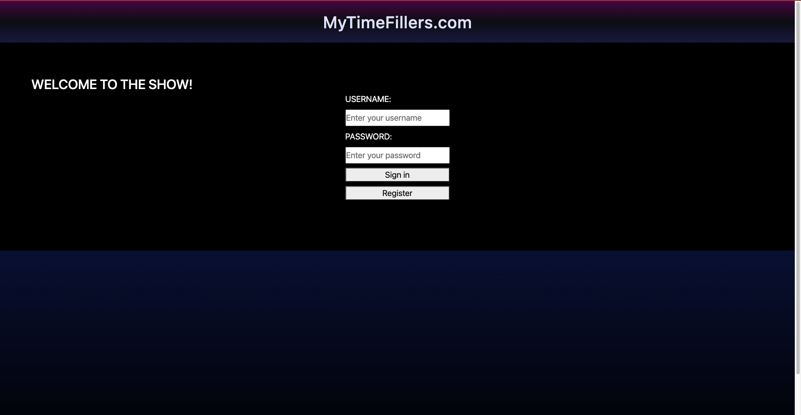

When you register for an account, you can create your first collection using the dropdown menu and clicking "Create a colleciton".

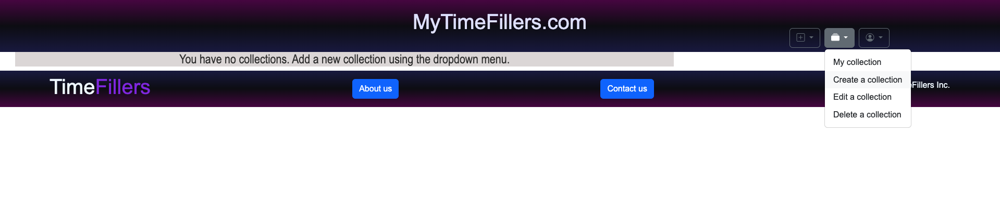

You will be prompted to enter a name for the collection and you have the option to upload your own image to show off your collection. When you click "Save", the collection will be added and you'll be taken back to the home page where you can see your new collection.

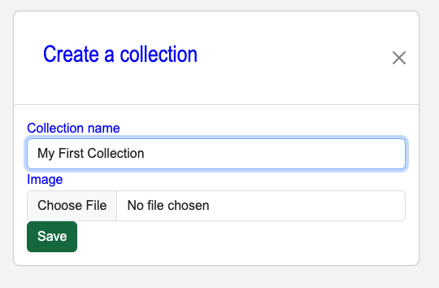

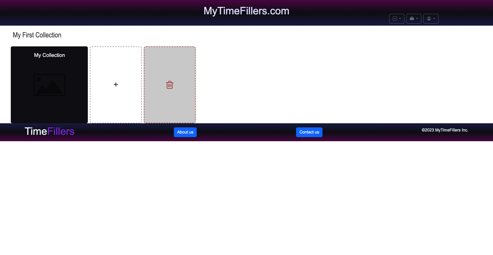

To add an item to your collection, click the card with the "+" symbol.

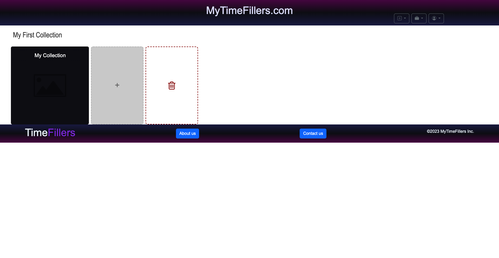

You'll then be taken to the search page where you can search the database for any movie, tv show, or book. Use the toggles to choose between the type of media you want to search for.

After you search, click on the item you want to know more about. The information will be displayed on the side. If this is the media you would like to add, click the "Add" button under the overview to add it to your collection.

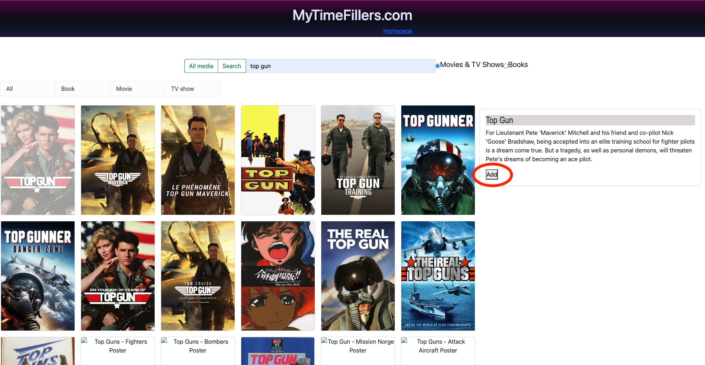

You'll be taken back to your home page where you can see the media you just added. Repeat this process to add more items.

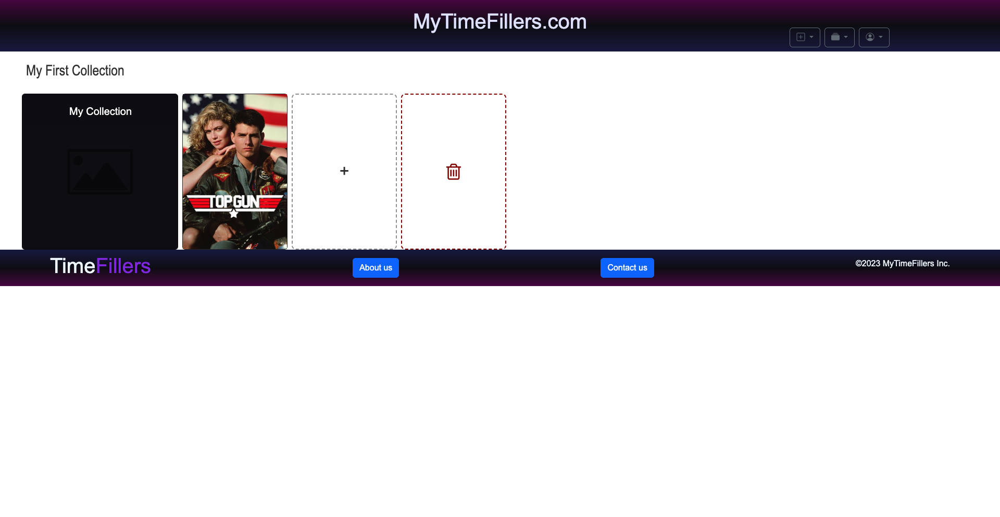

Similar to adding an item, you can delete an item by clicking on the image and then the "Remove" button under the overview.

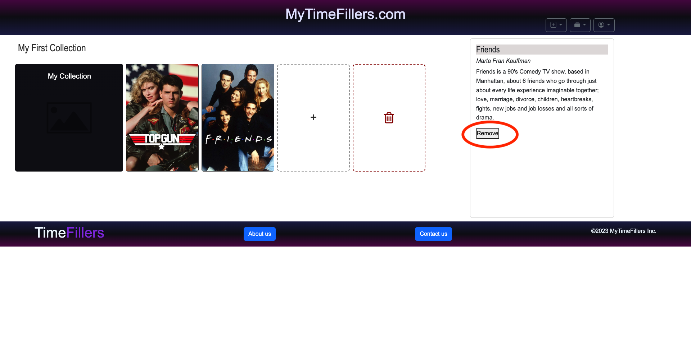

If you didn't upload an image when creating the collection, or if you want to change the image, click the image/placeholder and choose an image to upload when prompted. Click "Save" and your image will be uploaded and shown at the beginning of your collection.

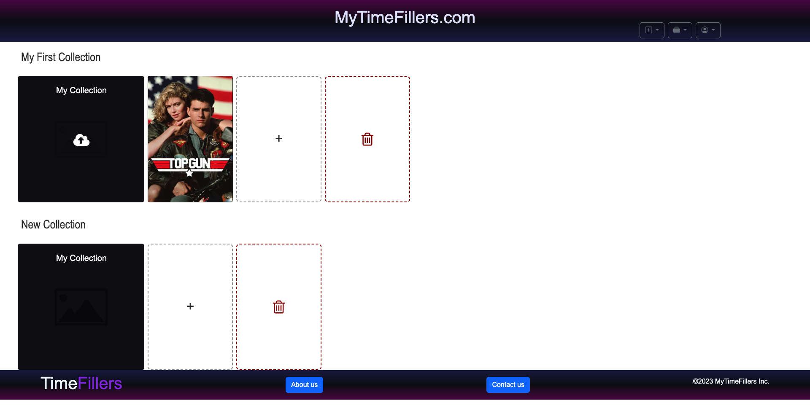

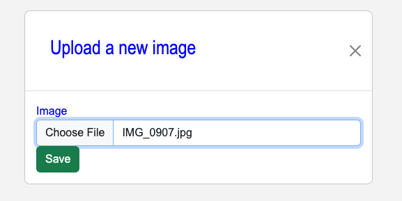

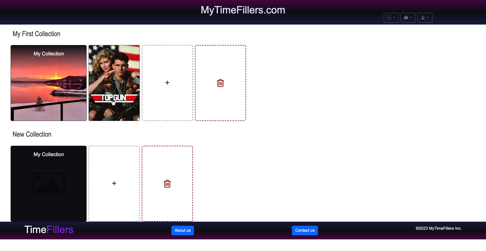

To delete a collection enitrely, click the red card with the trash icon. An alert will pop up to confirm that you want to delete the collection. Click yes to continue.

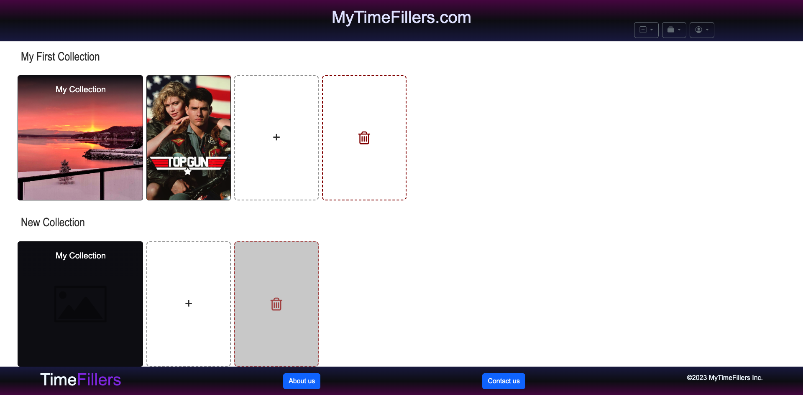

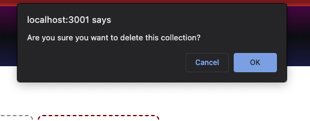

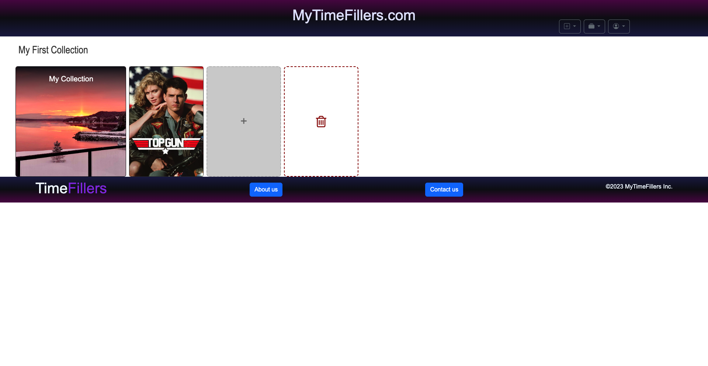

To log out, navigate to the account dropdown with the person icon and select "sign out". You'll then be taken back to the login page.

Users can create, update and delete collections of Books, Movies and TV Shows they have in their own collection

## Installation

Not Applicable at this time

## Contributing

Not Applicable at this time

## Tests

Will be added at later date

## License

This project is licensed under the [MIT](https://opensource.org/licenses/MIT) license.

## Questions

Find me on GitHub: [EliteHuskie](https://github.com/EliteHuskie)

Contact me at: [EliteHuskie@gmail.com](mailto:EliteHuskie@gmail.com)
